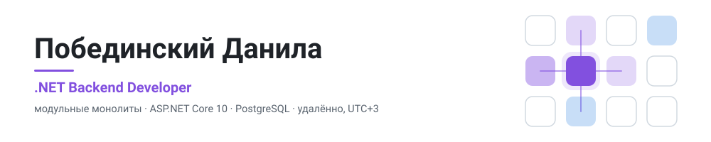

  <picture>
    <source media="(prefers-color-scheme: dark)" srcset="assets/header-dark.svg">
    <source media="(prefers-color-scheme: light)" srcset="assets/header-light.svg">
    
  </picture>

  

> [!NOTE]
> **Открыт к работе.** Удалённо, .NET backend: найм, фриланс, проектная работа.
> Служба закончена, военный билет на руках, так что через полгода я никуда не пропаду.

---

## Коротко

**3 года 5 месяцев коммерческой разработки**, начал в 16 лет на первом курсе техникума.
Сначала заказная разработка в «ВЭБ-Разработка», потом ПО для электроэнергетики
в «Монитор Электрик»: внутренние сервисы на WebAPI, EF Core и PostgreSQL, данные
с тысяч подстанций.

Сейчас делаю два своих продукта. Это не учебные проекты: на каждое спорное решение
есть ADR, миграции идут отдельным шагом деплоя, перед стартом проверяется окружение,
а у внешних сервисов лежат рядом фейковые реализации, чтобы тесты не падали из-за
чужого сервера.

---

## Проекты

### Istok. Фабрика сенсорных стендов для музеев 🔒

Раньше каждый стенд в зале был отдельной программой под конкретную выставку. Здесь
сотрудник музея собирает стенд в браузере: экраны, кнопки-хотспоты, фото, видео, PDF.
На выходе получается Windows-приложение или zip для браузера-киоска. Работает без интернета.

`ASP.NET Core 10` · модульный монолит на 10 модулей · `PostgreSQL` · `Redis` · `MinIO` · `Next.js 16` · `Tauri v2 / Rust` · монорепо pnpm + Cargo · `Docker Compose` · GitLab CI

### Potok. Контроль топлива в автопарке 🔒

«Цифровая камера в бензобаке». SaaS для парков на 10-150 машин. Считает, сколько топлива
машина должна была потратить по пробегу и норме, сверяет с фактическими заправками по
топливной карте и при расхождении шлёт владельцу алерт в Telegram: слив, ночная заправка,
приписанный пробег.

`.NET 10` · модульный монолит на 12 модулей · схема на модуль в `PostgreSQL` · Outbox/Inbox · мультиарендность · `FluentValidation` · `Flutter` · Razor Pages · Wialon · ЮKassa

> 🔒 Приватные. Код и архитектуру показываю на созвоне: от схемы модулей до конкретных ADR.

### Остальное

| Репозиторий | О чём | Стек |
|---|---|---|
| [dotpilot](https://github.com/DotNotFact/dotpilot) | Портативный центр управления ПК: сеть, звук, профили, разгон видеокарты через NVAPI с автоматическим откатом | Tauri v2, Rust, TypeScript |
| [lead-radar](https://github.com/DotNotFact/lead-radar) | Telegram-бот: следит за hh.ru, Kwork, RemoteOK, Freelancer и RSS в поисках заказов, оценивает и уведомляет | Python |
| [viridisca](https://github.com/DotNotFact/viridisca) | LMS: бэкенд модульным монолитом плюс десктопный клиент | ASP.NET Core, PostgreSQL, Avalonia |
| [auto-market](https://github.com/DotNotFact/auto-market) | Каталог автомобилей, монорепо `/api` и `/web` | ASP.NET Core, Angular |
| [revit-plugin-installer](https://github.com/DotNotFact/revit-plugin-installer) | Менеджер плагинов Revit: установка, бэкапы, экспорт и импорт | WPF, .NET 10 |
| [todo-server](https://github.com/DotNotFact/todo-server) | ToDo REST API | ASP.NET Core 10, EF Core, PostgreSQL, Scalar |
| [learning-platform](https://github.com/DotNotFact/learning-platform) | LMS: курсы, видеоуроки, тесты, задания, сертификаты | Next.js 16, Prisma 7 |

---

## Как я принимаю решения

У каждого пункта ниже есть четвёртый абзац: чем я за это заплатил. У любого решения есть
цена, и про неё лучше говорить сразу.

<b>Одно ядро плеера вместо восьми версий продукта</b>

 

**Кому было больно.** Сотрудник музея не мог поменять фотографию на стенде без программиста. Под каждый зал приложение писали заново, неделями.

**Почему нельзя просто.** У меня самого накопилось восемь версий такой программы, и все упирались в одно: то, что видит редактор, и то, что показывает стойка, это разный код. Держать два кода одинаковыми через ревью и тесты не выходит. Они расходятся быстрее, чем это успевают заметить.

**Что сделал.** Одно ядро плеера: `packages/runtime`, чистый TypeScript без привязки к окружению. Вокруг него три сменные оболочки: браузер, Windows-приложение, киоск. Они говорят с ядром через интерфейс `ShellAdapter`, за которым спрятано всё, что зависит от платформы. Ядро никогда не спрашивает, какая вокруг него оболочка, только «умеешь ли ты полный экран». Превью в редакторе это буквально тот же плеер, который поедет в зал.

**Чем заплатил.** Ядро нельзя писать на удобном фреймворке, только на голом TypeScript, иначе оболочки перестают быть сменными. Писать так медленнее и скучнее. И каждую новую фичу надо сразу продумывать для всех трёх оболочек.

<b>Событие пишется в ту же транзакцию, что и данные</b>

 

**Кому было больно.** Владелец автопарка должен узнать о сливе топлива. Если данные записались, а уведомление не ушло, он ничего не узнает и будет думать, что всё в порядке.

**Почему нельзя просто.** База и брокер сообщений это две разные системы, общей транзакции у них нет. Упадёшь между записью и отправкой, и получишь либо данные без события, либо событие без данных. Молча.

**Что сделал.** Outbox. `InsertOutboxMessagesInterceptor` кладёт событие в ту же транзакцию, что и сами данные, а `OutboxProcessor` потом разбирает очередь. Сверху `DerivedEventId`: идентификатор события считается как SHA-256 от входных данных, поэтому повторная публикация даёт тот же Id, и Inbox отбрасывает дубль.

**Чем заплатил.** Доставка стала асинхронной, то есть не мгновенной. Появилась своя таблица, за которой надо следить, и фоновый процесс, который может отстать.

<b>Повторный запрос не создаёт вторую заправку</b>

 

**Кому было больно.** Водитель заправляется там, где нет связи. Телефон складывает операцию в очередь и отправляет, когда сеть появится. Иногда отправляет дважды, и лишняя заправка ломает всю сверку.

**Почему нельзя просто.** Связь обычно рвётся не до, а после: запрос дошёл, заправка записана, а ответ потерялся по дороге назад. Телефон видит ошибку сети и честно повторяет. Проверка «нет ли уже такой записи» тут не помогает: две одинаковые заправки могут быть настоящими.

**Что сделал.** Ключ идемпотентности в заголовке `Idempotency-Key`, решение записано в ADR 0007. Сервер помнит ключ и на повтор возвращает тот же результат вместо второй записи.

**Чем заплатил.** Теперь клиент обязан сам сгенерировать ключ и хранить его до подтверждения. Сложность переехала в мобильное приложение, где отлаживать её тяжелее.

<b>Отказ от MediatR</b>

 

**Кому было больно.** Мне. Поддерживать это буду я один.

**Почему нельзя просто.** Обычно для CQRS в .NET берут MediatR. Мне нужны были ровно четыре интерфейса: команда, запрос и два обработчика. Ради этого библиотека приносит рефлексию в рантайме и прячет, кто именно обработает вызов.

**Что сделал.** Написал четыре интерфейса сам, решение записал в ADR 0003. В рантайме никакой рефлексии, эндпоинт получает нужный обработчик напрямую через DI, а F12 ведёт в конкретный класс, а не в диспетчер.

**Чем заплатил.** Логирование, валидацию и транзакции пришлось навешивать декораторами руками. И новому человеку в проекте надо один раз объяснить, почему здесь сделано не как у всех.

<b>Правило, которое я сам отменил вместе с его тестом</b>

 

**Кому было больно.** Сотруднику музея, который качает готовый стенд на плохом интернете.

**Почему нельзя просто.** У меня было правило «одна ссылка, одно скачивание», ради безопасности, и оно было закреплено тестом. Потом настоящий стенд после растеризации PDF оказался **3,17 ГБ**. Обрыв на девяноста процентах означал начинать заново. Защита превратилась в «человек не может забрать свой файл».

**Что сделал.** Удалил правило вместе с тестом. Теперь ссылка живёт заданный срок и умеет докачивать с места обрыва.

**Чем заплатил.** Ссылку внутри этого срока действительно можно переслать. Я обменял это на то, что файл вообще доходит.

<b>PDF растеризуется на сервере, а стойка листает картинки</b>

 

**Кому было больно.** Владельцу, у которого на стенде вместо документа был пустой экран.

**Почему нельзя просто.** PDF показывали встроенным просмотрщиком движка. На его машине WebView2 или выключен политикой, или не открывает документ. Обе причины вне моего контроля, починить их у заказчика я не могу.

**Что сделал.** Убрал эту зависимость совсем. Документ заранее разбирается на страницы на сервере, в изолированном воркере: без сети, только чтение, seccomp, лимиты. В стенд едут готовые картинки, посетитель листает их пальцем.

**Чем заплатил.** Сборка стала тяжелее и дольше, и именно из-за растеризации стенд вырос до трёх гигабайт. Текст в таком PDF больше нельзя выделить и найти поиском.

---

## Стек

Отдельно держу то, за что мне платили, и то, что применял на своих продуктах.
Это разные списки.

**В проде, коммерческий опыт**

- **Язык и платформа**: C#, ASP.NET Core, WebAPI
- **Данные**: EF Core, Dapper, PostgreSQL, MS SQL, оптимизация тяжёлых запросов с переходом на raw SQL
- **Интеграции**: REST, SOAP со SCADA-системами и десктоп-клиентами, OpenXML для генерации отчётов Excel и Word по готовым шаблонам
- **Процесс**: Git, GitLab, код-ревью, Azure DevOps как трекер и декомпозиция, Scrum, SAFe

**В своих продуктах, в проде этого не было**

- **Архитектура**: модульный монолит, схема на модуль, CQRS на своих хендлерах, Outbox/Inbox, Value Objects, мультиарендность
- **Инфраструктура**: Redis, MinIO, Docker Compose, GitLab CI
- **Клиенты**: Next.js, Tauri v2, Flutter, Avalonia, WPF
- **Прочее**: FluentValidation, ADR как рабочий инструмент

---

## Чего у меня нет

Пишу сам, до вопроса, чтобы никто не тратил время:
**Kafka, Kubernetes, RabbitMQ в проде, высокие нагрузки, шардирование.**
Я с этим не работал и писать, что работал, не буду.

---

## Опыт

| Период | Место | Роль |
|---|---|---|
| Авг 2024 - Июл 2025 | [Монитор Электрик](https://www.monitel.com), Иноземцево | Инженер-программист. ПО для электроэнергетики, кросс-функциональная SAFe-команда |
| Мар 2022 - Авг 2024 | ООО «ВЭБ-Разработка», Пермь | Fullstack Developer, заказная разработка для корпоративных клиентов |

Образование: Северо-Кавказский Финансово-Энергетический техникум, Ессентуки, 2025,
«Информационные технологии и программирование, C# Разработчик». Английский B1.

---

**[Telegram @dotnotfact](https://t.me/dotnotfact)** - лучше всего писать сюда

apxauk@gmail.com · г/к Ессентуки, UTC+3 · только удалёнка

